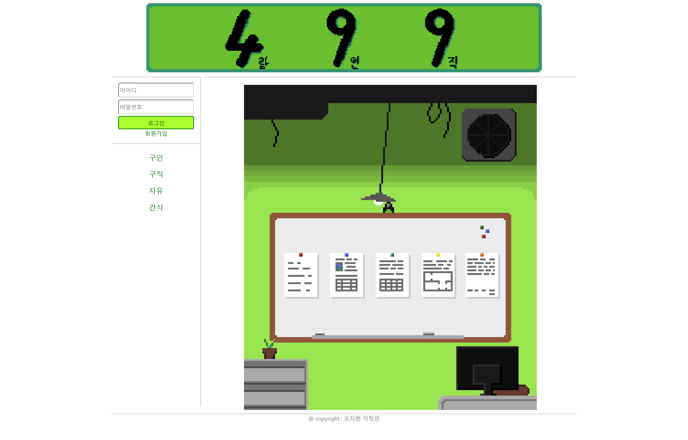
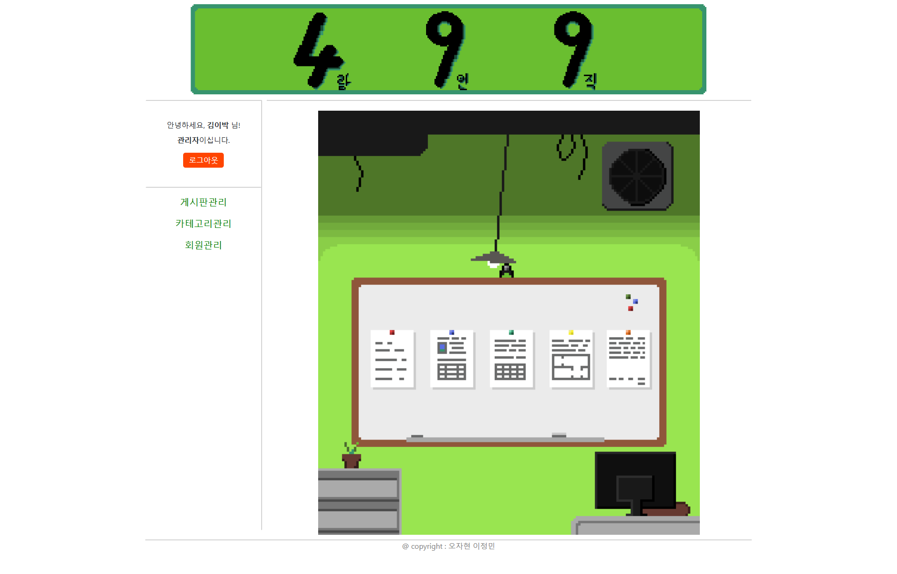

# Spring_Final_project

## 소개
이 프로젝트는 2학기 스프링부트 수업의 최종 과제로 개발되었습니다. Spring Boot를 활용하여 웹 애플리케이션을 구축하였습니다.

## 역할분담
- **오자현**: 백엔드담당
- **이정민**: 프론트엔드담당

## 주요 기능
- **사용자 인증 및 권한 부여**: 회원가입, 로그인, 로그아웃 기능과 사용자 권한 관리.
- **게시판 기능**: CRUD 기능을 갖춘 게시판 모듈.
- **RESTful API 제공**: 외부 시스템과의 연동을 위한 API 엔드포인트 제공.

## 기술 스택
- **백엔드**: Java, Spring Boot, Spring Security, JPA/Hibernate
- **프론트엔드**: HTML5, CSS3, JavaScript, Thymeleaf
- **데이터베이스**: MySQL
- **빌드 도구**: Maven
- **버전 관리**: Git

## 주요 화면
- **index**

- **adminIndex**


- 자세한 내용은 발표자료에 담았습니다.
# 프로젝트 발표 자료

아래 링크에서 PPT 파일을 다운로드할 수 있습니다:

[Download PPT](https://github.com/ohjaoh/Spring_Final_project/raw/main/사람구인구직사이트(499).pptx)

## 설치 및 실행 방법
1. **클론 저장소**:
   ```bash
   git clone https://github.com/ohjaoh/Spring_Final_project.git
2. **프로젝트 디렉토리로 이동**:
    ```bash
    cd Spring_Final_project
    
3. **application.properties 파일 생성**:
    ```bash
    프로젝트의 루트 디렉토리의 src/main/resources에 아래 가이드를 참고하여 application.properties 파일을 작성하세요.   
# application.properties 설정 가이드

이 문서는 프로젝트 실행을 위해 필요한 `application.properties` 파일의 설정 방법과 필드에 대한 설명을 제공합니다.

---

## 파일 위치
`src/main/resources/application.properties`에 파일을 생성해야 합니다.

---

## 설정 파일 예시

```properties
# 애플리케이션 이름
spring.application.name=SpringFinalProject

# MySQL 설정
spring.datasource.url=jdbc:mysql://<YOUR_MYSQL_HOST>:3306/<DATABASE_NAME>
spring.datasource.username=<YOUR_USERNAME>
spring.datasource.password=<YOUR_PASSWORD>
spring.datasource.driver-class-name=com.mysql.cj.jdbc.Driver

# JPA 관련 설정
spring.jpa.database=MYSQL
spring.jpa.database-platform=org.hibernate.dialect.MySQLDialect
spring.jpa.show-sql=true
spring.jpa.properties.hibernate.format_sql=true
spring.jpa.hibernate.ddl-auto=update

# Thymeleaf 경로 설정
spring.thymeleaf.prefix=classpath:/templates/thymeleaf/

# 서버 포트 설정
server.port=8090
```

## 각 설정 필드 설명

| 필드                              | 설명                                  | 예시                                 |
|-----------------------------------|---------------------------------------|--------------------------------------|
| `spring.datasource.url`           | MySQL 서버 주소                       | `jdbc:mysql://localhost:3306/mydb`   |
| `spring.datasource.username`      | MySQL 사용자 이름                    | `root`                               |
| `spring.datasource.password`      | MySQL 비밀번호                        | `password123`                        |
| `spring.datasource.driver-class-name` | JDBC 드라이버 클래스               | `com.mysql.cj.jdbc.Driver`           |
| `spring.jpa.database-platform`    | Hibernate에서 사용할 데이터베이스 방언 | `org.hibernate.dialect.MySQLDialect` |
| `server.port`                     | 애플리케이션 실행 포트                | `8090`                               |
